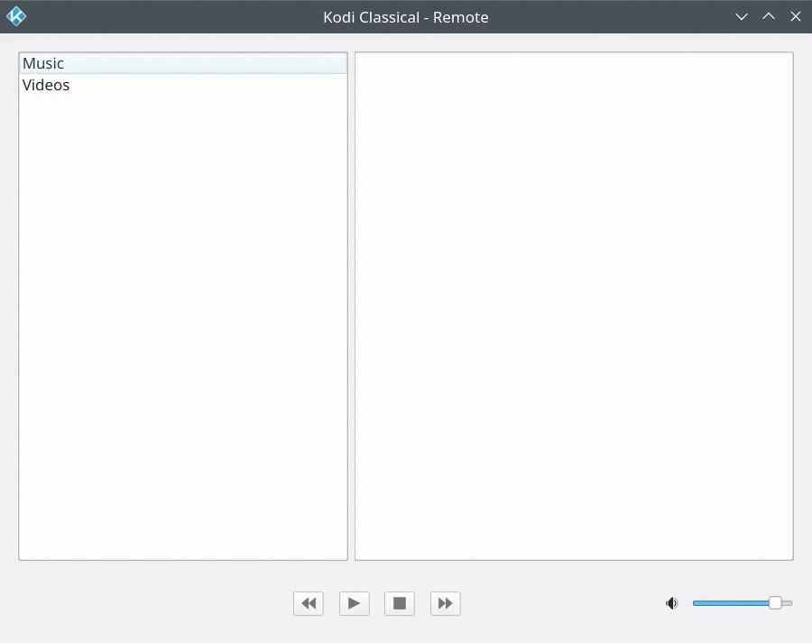

# kodi-classical
<br/><br/>
kodi-classical is a collection of scripts to ease playback and curation of recorded classical music broadcasts.
<br/><br/>
## kodi-remote
[**kodi-remote**](./kodi-remote/kodi-remote.py) is a [Kodi](https://kodi.tv/download/) remote control. Although very basic, it has a few tricks:

Suppose you have 'recorded' thousands of live classical concerts (solely for your own private and personal enjoyment of course). You probably haven't had the time to tag them, besides id3v1 was conceived for popular music and even the classical-oriented tags of later versions are too limited to be of much use.

Instead you may have scraped the broadcast webpage for composer(s), performer(s) and other textual information. If you saved this with the same stem as the media file, e.g. some-broadcast.mp3, some-broadcast.txt, each in the same folder, [**playlist-generator**](#playlist-generator) can create .pls playlists for said broadcast and siblings. ('Title[n]' fields will contain broadcast details.)

Organised thus, [**kodi-remote**](./kodi-remote/kodi-remote.py) provides a convenient way to browse and play broadcast recordings ([**screenshot**](#screenshots)):

<screenshot>

To filter a playlist by artist and/or composer, use the following syntax (case insensitive}:

```bash
<word (beginning or complete)>+<word (beginning or complete)>...
```

To match alternative spellings:

```bash
<word (beginning or complete)>|<word (beginning or complete)>...
```

For example:

janso+tchai|tschai|tsjai|tjaj may well find UK/US/French, German, Dutch and Scandinavian broadcasts that include works by Tchaikovsky conducted by Mariss Jansons.

<screenshot>

There is no need to use a language virtual keyboard either - bartok will do for Bartók. (Latin characters with diacritics will be reduced to their plain equivalents.)

Finally, to browse and filter your complete collection of playlists, click the 'Combine' button bottom left. Shortcuts and other behaviours are described [here](./kodi-remote/usage.txt).

**A few caveats**: Only .pls, m3u and m3u8 playlists are supported. To be 'combineable' a folder must not contain anything other than playlist files. And, as yet, [**kodi-remote**](./kodi-remote/kodi-remote.py) has only been tested under Linux (Ubuntu 21.04), although Windows and macOS have been considered in design.

[**kodi-remote**](./kodi-remote/kodi-remote.py) [dependencies](#dependencies) are Python >= 3.7, PySide6, Qt >= 6.4, kodijson, psutil, requests and websocket.
<br/><br/>
## playlist-generator
[**playlist-generator**](./playlist-generator/playlist-generator.py) generates .pls playlists for recorded radio broadcasts.

It presents a file picker to choose the mediafile sources folder, e.g.

~/Radio/Stations | %USER_PROFILE%\Radio\Stations

Followed by another to choose the destination folder for playlists, e.g.

~/Radio/Playlists | %USER_PROFILE%\Radio\Playlists

NB Both source and destination folders must share the same parent, e.g.

~/Radio | %USER_PROFILE%\Radio

This is because playlist mediafile paths are written relative to the playlists folder so that the parent tree can be easily moved or copied to one of your other devices.

[**playlist-generator**](./playlist-generator/playlist-generator.py) accepts a single (optional) command line argument to set the root folder for the file pickers, e.g.

```bash
playlist-generator.py [ ~/Radio | %USER_PROFILE%\Radio ]
```

[**playlist-generator**](./playlist-generator/playlist-generator.py) [dependencies](#dependencies) are Python >= 3.7, PySide6, Qt >= 6.4 and pymediainfo.
<br/><br/>
## playlist-recomposer

[**playlist-recomposer**](./playlist-recomposer/playlist-recomposer.py) generates .pls playlists from other playlists, where broadcast details may include works numbered according to the following catalogues:

```bash
Opus Numbers
BWV (Bach-Werke-Verzeichnis)
Köchel
Deutsch
Hoboken
```

For example:

```bash
Op. 73 - Beethoven, Emperor Concerto
BWV. 243 - Bach, Magnificat
K. 551 - Mozart, Jupiter Symphony
D. 760 - Schubert, Wanderer Fantasy
Hob.XVI/20 - Haydn, Sonata in C minor
```

It is tolerant, to a degree, of punctuation, whitespace and prefixes to catalogue numbers in various different languages, e.g. No., N° and Nr.

It presents a file picker to choose the playlists source folder and select catalogues, e.g.

~/Radio/Playlists | %USER_PROFILE%\Radio\Playlists

Followed by another to choose the destination folder for catalogued playlists, e.g.

~/Radio/Catalogue Playlists | %USER_PROFILE%\Radio\Catalogue Playlists

NB Both source and destination folders must share the same parent, e.g.

~/Radio | %USER_PROFILE%\Radio

**Caveats**: This is a beta version: Only .pls playlists are supported. The regular expressions used to search for catalogue name abbreviations could probably be refined. And composer catalogue names that share the same abbreviation, e.g. K for Mozart and Scarlatti, need further consideration. 

[**playlist-recomposer**](./playlist-recomposer/playlist-recomposer.py) dependencies are Python >= 3.7, PySide6 and Qt >= 6.4.
<br/><br/>
## Dependencies

Python >= 3.7

Qt >= 6.4

[Get and Install Qt](https://doc.qt.io/qt-6/get-and-install-qt.html)

PySide6

```bash
pip install PySide6
```

### Additional dependencies ###

[**kodi-remote**](./kodi-remote/kodi-remote.py)

kodijson

```bash
pip install kodijson
```

psutil

```bash
pip install psutil
```

requests

```bash
pip install requests
```

websocket

```bash
pip install websocket
```

[**playlist-generator**](./playlist-generator/playlist-generator.py)

pymediainfo

```bash
pip install pymediainfo
```
<br/><br/>
## Screenshots
<br/><br/>

<br/><br/>
<br/><br/>

<br/><br/>
## playlist-recomposer


